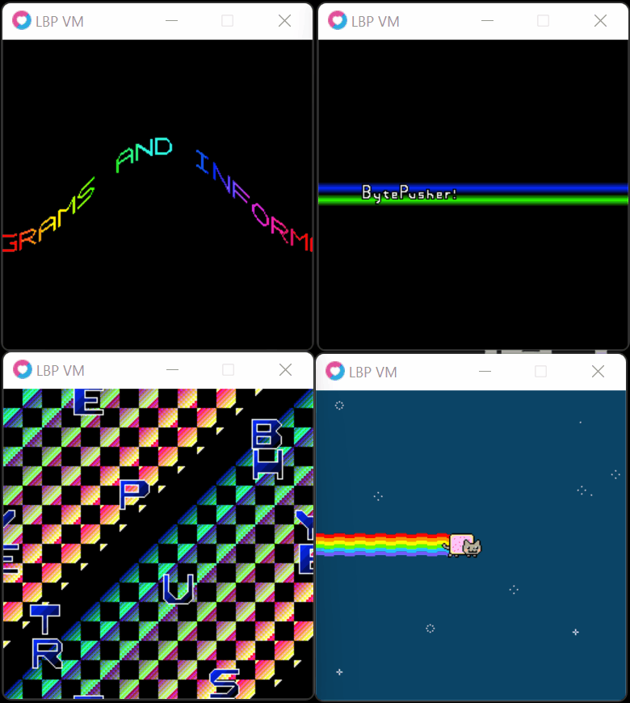

# LBP

Bytepusher VM implementation using Lua/Love2D

## Samples



## Building

**Requirements**

- [Love2D](https://love2d.org/)
- [Lua](https://www.lua.org/download.html)

### Run

```
love . "roms/ROM.bp"
```
> **Note**
> If inside the LBP folder

or

```
love LBP "roms/ROM.bp"
```
> **Note**
> If outside the LBP folder

## Todo

priority

- [x] Core
- [x] Gfx
- [x] Input(keys)
- [ ] Audio

optional

- [ ] clean code structure

## Credits

- [Love2D](https://love2d.org/)
- [Lua](https://www.lua.org/about.html)
- [BytePusher Documentation](https://esolangs.org/wiki/BytePusher)

## Contribute

Feel free to contribute, i have a Todo section to check what I have not implemented yet.
